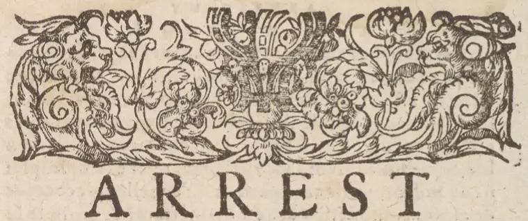
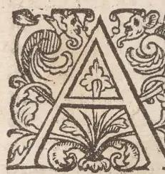

# A R R E S T 

DV PARLEMENT DE Tholofe, contenant vne hiftoire memorable, \& prodigieufe, auec cêt \& onze belles \& doctes annotations, de monfieur maiftre Iean de Coras, rapporteur du procès.

36 Texte de la Toile du procès, \& de Tarreft.

V MOIS de Ianuier, mil cinq cens cinquante neuf, Bertrande de Rols, du lieu d'Arrigat, au diocefe de Ricux, fe rend fuppliant, \& plaintiue deuant le iuge de Ricux, difant, que vingt anspeuuent eftre paffez, ou enuiron, qu'elle eftant ieune fille, de neuf à dix ans, fut mariée auec Martin Guerre, pour lors aufsi fort ieune, \& prefque de mefme aage que la fuppliant.